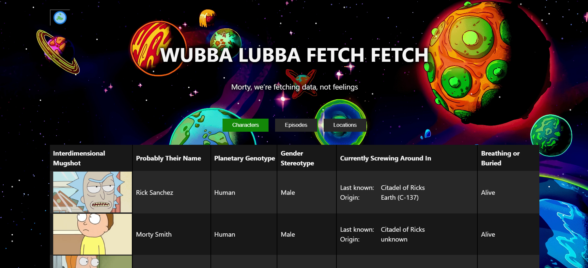

# WUBBA LUBBA FETCH FETCH

A TypeScript and React (with Vite) for fetching and displaying data from the Rick and Morty API. Handles characters,
episodes, and
locations.



---

## Features

- Fetches all characters, episodes, and locations from the [Rick and Morty API](https://rickandmortyapi.com/)
- Handles API pagination automatically
- Responsive UI: table view for desktop, card view for mobile/tablet
- Dark and light mode toggle
- Built with TypeScript, React, and Vite

---

### Technologies

- TypeScript
- React (with Vite)
- Less for styling
- Rick and Morty API (REST & GraphQL)

## API Integration

- **REST Base URL:** `https://rickandmortyapi.com/api`
  - `/character`
  - `/episode`
  - `/location`
- **GraphQL Endpoint:** `https://rickandmortyapi.com/graphql`

Pagination is handled automatically; up to 20 items per page are fetched and merged.

---

## Installation

1. **Clone the repository:**

   ```bash
   git clone https://github.com/Friftycode/wubba-lubba-fetch-fetch.git
   cd wubba-lubba-fetch-fetch

   ```

2. **Install dependencies:**

```bash
npm install
```

3. Run the app in development mode:

```bash
npm run dev
```

Visit the URL Vite outputs (typically http://localhost:5173/).

---

## Usage

- Use the toggle at the top to switch between dark and light mode.
- Select between Characters, Episodes, or Locations using the view selector.
- Pagination controls appear if there are multiple pages of data.
- Responsive design: tables on desktop, cards on mobile/tablet.

---

### Credits

[Rick and Morty API](https://rickandmortyapi.com/)
